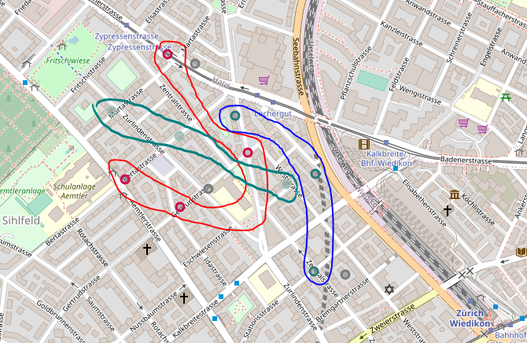
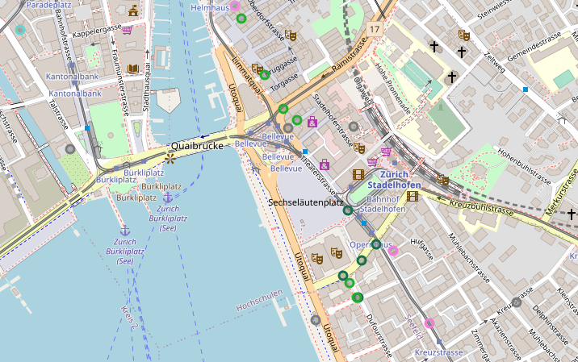

## Introduction/Business Problem
The idea of this project is to help potential new restaurants founders help pick a location in the city. It will show the distribution and density of current locations in the city on a map. Also location data will be clustered based on types of locations, which will show the potential restaurant founder where in the city the market for certain type of restaurant is already satisfied.

## Data
Data for this project will be obtained using Foursquare API that can provide location based data about different types of venues (in this case will be interested in restaurants).
Foursquare provides a [Places API](https://developer.foursquare.com/docs/places-api) with `venues` endpoint. We will use `venues` endpoint to retrieve list of venues from `food` category for the defined location.
An `item` returned from the API contains (among others):
* `name`
* `longitude`
* `latitude`
* `category`

which we will use in the analysis.

## Methodology
For our case, we retrieved data about 247 venues which belonged to 55 different categories. As part of the analysis retrieved locations were displayed on a map based on their geographical location to analyse visually it's density.

As next step DBSCAN clustering algorithm was applied on the data. DBSCAN is a density-based clustering algorithm which clusters together data points of similar characteristics. In our case that would be geo location and category of the place. DBSCAN has the concept of "outliers", which means that not all of the data has to be assigned to a cluster, also one does not need to define the number of clusters because DBSCAN algorithm define the clusters on it's own depending on the defined "minimal number of neighbors" and "maximal distance" from a neighbor.

Both of this properties are exactly what we require for our case, since we want to find even small groups (clusters) of restaurants of similar type which are close together geographically also we are not interested in assigning a restaurant that is one of it's kind (outlier) in the neighborhood to any cluster.

For the algorithm to work properly categories were encoded, so that similar categories have consecutive codes e.g.
* "Italian Restaurant": 10, "Pizza Place": 11, "Mediterranean Restaurant": 12
* "Thai Restaurant": 51, "Indian Restaurant": 52, "Asian Restaurant": 53, "Sushi Restaurant": 54, "Chinese Restaurant": 55

this way they can be assigned to same clusters.

## Results
DBSCAN was setup to find small clusters with minimum of 2 locations on a quite limited space. Hence there are many small clusters visible on the map. After picking a location we can analyse if there are groups of similar kind of locations in the neighborhood and by checking the places information that belong to a cluster one can see what type of places are more common in the area.

 

## Discussion
Based on the results we can say there are many hotspots in the city for certain type of locations. E.g. in first from above examples seems like there is enough of italian and asian restaurants for such a small region, so most probably not a best business idea to setup yet another of that kind.
Similarly, for the second case, looks like there is quite an overload of swiss restaurants (light green circle), but no wonder it's an old town region of the city.

## Conclusion
Analysis done in the project might give good preliminary insight and overview of the city gastronomical scene, which might be of significant value when planning to enter this business.